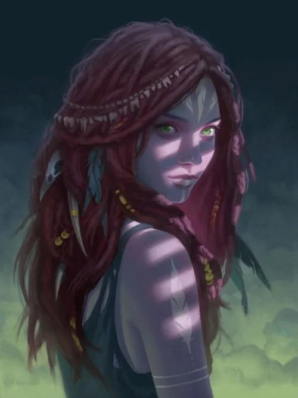
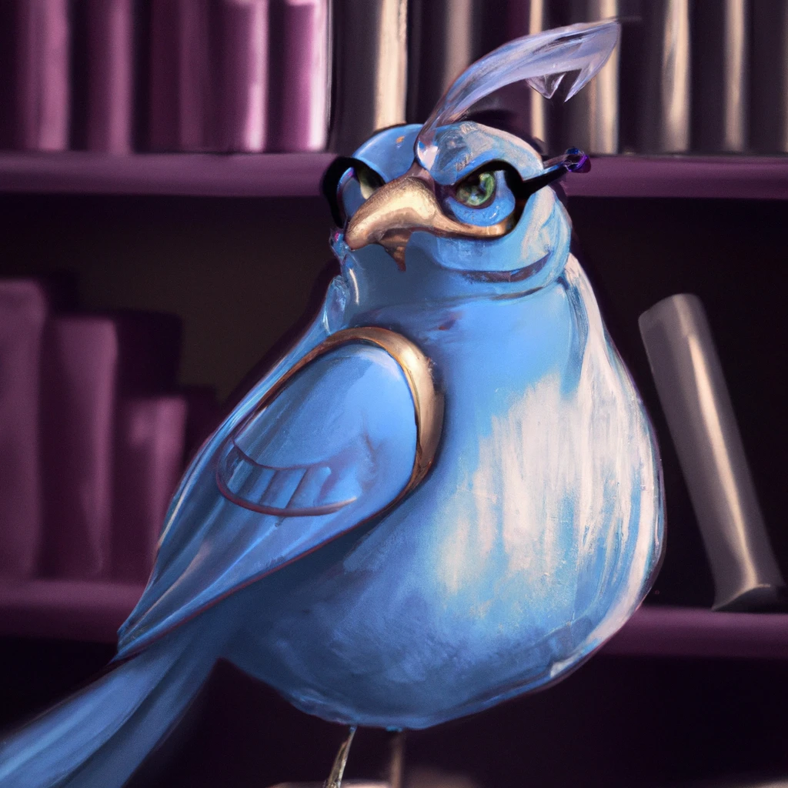

| 姓名            | 种族     | 阵营     | 语言   |
| --------------- | -------- | -------- | ------ |
| 伊露莉·谢蕾妮尔 | 神裔     | 中立善良 | 通用语 |
| **性别**        | **体型** | **信仰** |
| 女              | 中型     | 萨满信仰 |

角色简介

伊露莉是一个复杂身世的萨满，她家族的私生子，父亲是人类贵族，母亲是父亲家中的女仆，有神裔血统。在她成长的过程中，她遭受了来自家庭和周围人的歧视和欺凌。然而，她发现自己具有一种特殊的能力，可以与自然界中的生命之魂建立联系。随着时间的推移，她不断磨练自己的萨满神力，成为了一名流浪的萨满。

她有着明亮的蓝色眼睛和长发，身材婀娜多姿，通常穿着简朴的服装，表现出她的与众不同和与自然的联系。她的魂兽是一只自称是神龙王(Dragon Lord)的蓝色画眉鸟，与它建立的心灵联系帮助她保护大自然并帮助那些需要帮助的人。

种族特性替换

**人之子（Scion of Humanity）**：一些神裔的天界血统已非常淡薄。该种族特性让神裔在判断种族时同时被判定为一个本地异界生物和类人生物（人类），在计算专长和法术先决条件时被算作类人生物。她不必使用易容技能即可伪装成人类。该种族特性从起始语言里删除天界语并改变生物类别。

### 属性

|      | 属性 | 修正值 | 初始 | 调整   |
| ---- | ---- | ------ | ---- | ------ |
| 力量 | 10   | 0      | 10   |        |
| 敏捷 | 14   | +2     | 14   |        |
| 体质 | 14   | +2     | 14   |        |
| 智力 | 10   | 0      | 10   |        |
| 感知 | 18   | +4     | 16   | 神裔+2 |
| 魅力 | 16   | +3     | 14   | 神裔+2 |

#### 豁免

|      | 修正值 | 详情           |
| ---- | ------ | -------------- |
| 强韧 | +2     | 体质+2         |
| 反射 | +2     | 敏捷+2         |
| 意志 | +6     | 基础+2, 感知+4 |

#### 防御

|          | 值  | 详情                 |
| -------- | --- | -------------------- |
| HP       | 11  | 基础+8,升级+1,体质+2 |
| AC       | 16  | 敏捷+2,盔甲+4        |
| 接触     | 12  | 敏捷+2               |
| 措手不及 | 14  | 盔甲+4               |

#### 战斗

|      | 修正值 | 详情                 |
| ---- | ------ | -------------------- |
| 先攻 | +6     | 敏捷+2, 专长+4       |
| 专注 | +7     | CL+1, 感知+4, 称号+2 |
| BAB  | 0      |                      |
| CMB  | 0      |                      |
| CMD  | 12     | 敏捷+2               |

| 武器 | 伤害              | 攻击加值 | 详情   |
| ---- | ----------------- | -------- | ------ |
| 轻弩 | 1d8/19-20x2, 80ft | +2       | 敏捷+2 |
| 匕首 | 1d4/19-20x2       | +0       |        |

#### 其他

| 感官         | 速度 |
| ------------ | ---- |
| 黑暗视觉(60) | 30   |

| 抗性 | 值  | 详情 |
| ---- | --- | ---- |
| 寒冷 | 5   |      |
| 强酸 | 5   |      |
| 电击 | 5   |      |

### 职业: 萨满

| 等级 | FCB | 能力                                        | 专长                          |
| ---- | --- | ------------------------------------------- | ----------------------------- |
| 1    | HP  | 祷念, 魂域 - 苍天魂域, 魂兽, 魂术, 精魂之力 | 精通先攻(Improved Initiative) |

#### 魂域: 苍天魂域

| 环位 | 法术     | DC  |
| ---- | -------- | --- |
| 1 环 | 七彩喷射 | 15  |

**星夜尘沙(Stardust, SP)** [**6 次/天, -1, 1 轮**]: 以一个标准动作, 萨满召唤来一团星尘包裹 30 尺内一个生物. 星尘会使目标如同蜡烛一般发光, 并且不能从隐蔽和隐形效果中获得任何好处. 目标的攻击和基于视力的察觉检定都会获得-1 减值, 该减值在 4 级及之后每 4 级都会增加 1, 最高 20 级时的-6. 该能力持续轮数为萨满等级的一半. 不依靠视力的生物不受该能力影响. 该能力每日使用次数为 3+萨满魅力调整值.

### 称号

| 称号     | 效果   |
| -------- | ------ |
| 魔法学徒 | 专注+2 |

### 法术

| 环位 | 每日法术 | 法术                     | DC  |
| ---- | -------- | ------------------------ | --- |
| 0 环 | 3        | 晕眩术,侦测魔法,神导术   | 14  |
| 1 环 | 2(1+1)   | 祝福术,防护邪恶,七彩喷射 | 15  |

### 技能

技能点 4(等级 1x4 = 4)

| 技能         | 修正值 | 技能等级 | 本职 | 属性 | 其他           |
| ------------ | ------ | -------- | ---- | ---- | -------------- |
| 运动         | -2     | 0        | +0   | +0   | 盔甲-2         |
| 巧手         | 0      | 0        | +0   | +2   | 盔甲-2         |
| 特技         | 0      | 0        | +0   | +2   | 盔甲-2         |
| 隐匿         | 0      | 0        | +0   | +2   | 盔甲-2         |
| 骑术         | 0      | 0        | +0   | +2   | 盔甲-2         |
| 知识(自然)   | 0      | 0        | +0   | +0   |                |
| 知识(世界)   | 0      | 0        | +0   | +0   |                |
| 知识(宗教)   | +4     | 1        | +3   | +0   |                |
| 知识(奥秘)   | 0      | 0        | +0   | +0   |                |
| 语言学       | 0      | 0        | +0   | +0   |                |
| 察觉         | +7     | 1        | +0   | +4   | 神裔+2         |
| 沟通         | +12    | 1        | +3   | +3   | 神裔+2, 魔宠+3 |
| 使用魔法装置 | +4     | 1        | +0   | +3   |                |

### 装备

| 装备     | 价格 | 重量 | 其他           |
| -------- | ---- | ---- | -------------- |
| 链甲衫   | 100g | 25lb |                |
| 轻弩     | 35g  | 4lb  |                |
| 匕首     | 2g   | 1lb  |                |
| **合计** | 137g | 30lb | 轻载 34/66/100 |

## 魔宠

| 姓名     | 种族     | 阵营     |
| -------- | -------- | -------- |
| 神龙王   | 画眉鸟   | 绝对中立 |
| **体型** | **语言** | **变种** |
| 微型动物 | 通用语   | 智囊     |

  
**简介**

它喜欢看书，它不喜欢飞，它总是说个不停，它称自己为神龙王。

  
**智囊(Sage)**

智囊魔宠熟记各种实用的知识，它们会为了主人的利益而随时提供这些资讯，不过这也使它们显得傲慢不羁。

**本职技能(Class Skills）**：智囊将所有知识技能视为本职技能。

**聪明绝顶（Dazzling Intellect，Ex）**：智囊的智力总是等同于 5 + 它的等级，不过在判断智囊的额外天生防御调整时，视为其等级减半。该能力改变了魔宠的智力属性（Intelligence score）和天生防御调整（Natural Armor Adjustment）。

**智囊的学识（Sage’s Knowledge，Ex）**：智囊在记忆了大量咨询，足矣让它能够参与到任何话题中，而它也很乐意在一些细枝末节的事情上对主人发表长篇大论。智囊能够尝试所有未受训的知识检定，而且在所有知识检定上获得相当于其等级的 1/2 的加值。此外，智者每级会获得 2 个技能点。它在任意特定技能上投入的技能点数至多与其等级相等。该能力取代警觉（Alertness）以及享受主人技能级数（share its master’s skill ranks）的魔宠能力。

  
**魔宠能力**

  
**精通反射闪避 (Improved Evasion, Ex)**: 有些攻击效果若通过反射豁免可以减少一半伤害。如果魔宠遭到此类攻击，在通过反射检定后它将不受伤害，如果检定失败它也只受到一半伤害。

**法术共享 (Share Spells, Ex)**: 法师可以将目标为自身的法术施展在魔宠身上 (如同接触法术) 而不是自己身上。即使某些法术通常不会影响魔宠生物类型 (魔法兽)，主人也可以用这种方式和魔宠共享该法术。

**情感联结 (Empathic Link, Su)**: 主人和魔宠之间有着内心上的联结，情感联结的最远距离为 1 里。主人无法用魔宠的双眼去看，但是他们彼此分享心灵。由于这种连接的天生限制，只有一般的心灵感受可以被传递。因为这种情感联结，主人对那些魔宠曾经遇上的事物、或去过的地点也会建立起相同的关联。

### 属性

|      | 属性 | 修正值 | 初始 | 详情   |
| ---- | ---- | ------ | ---- | ------ |
| 力量 | 1    | -5     | 1    |        |
| 敏捷 | 15   | +2     | 15   |        |
| 体质 | 6    | -2     | 6    |        |
| 智力 | 6    | -2     | 5    | 等级+1 |
| 感知 | 15   | +2     | 15   |        |
| 魅力 | 6    | -2     | 6    |        |

#### 豁免

|      | 修正值 | 详情               |
| ---- | ------ | ------------------ |
| 强韧 | +0     | (主+0 宠+2) 体质-2 |
| 反射 | +4     | (主+0 宠+2) 敏捷+2 |
| 意志 | +4     | (主+2 宠+0) 感知+2 |

#### 防御

|          | 值  | 详情                               |
| -------- | --- | ---------------------------------- |
| HP       | 5   |                                    |
| AC       | 17  | 敏捷+2, 体型+4, 1 级魔宠天生护甲+1 |
| 接触     | 17  | 敏捷+2, 体型+4, 1 级魔宠天生护甲+1 |
| 措手不及 | 15  | 体型+4, 1 级魔宠天生护甲+1         |

#### 战斗

|      | 修正值 | 详情                          |
| ---- | ------ | ----------------------------- |
| 先攻 | +2     |                               |
| BAB  | +0     |                               |
| CMB  | -9     | BAB+0, 力量-5, 体型-4         |
| CMD  | 3      | BAB+0, 力量-5, 体型-4, 敏捷+2 |

#### 其他

| 感官     | 速度                                     |
| -------- | ---------------------------------------- |
| 昏暗视觉 | 10, 飞行 50(基础 40 + 苍天魂域 10, 一般) |

| 技能 | 修正值 | 详情                       |
| ---- | ------ | -------------------------- |
| 飞行 | +12    |                            |
| 察觉 | +5     | 感知+2, 技能专攻(察觉) + 3 |

| 技能       | 修正值 | 技能等级 | 本职 | 属性 | 其他   |
| ---------- | ------ | -------- | ---- | ---- | ------ |
| 知识(自然) | +3     | 1        | +3   | -2   | 等级+1 |
| 知识(世界) | +3     | 1        | +3   | -2   | 等级+1 |
| 知识(宗教) | 0      | 0        | +3   | -2   |        |
| 知识(奥秘) | 0      | 0        | +3   | -2   |        |
