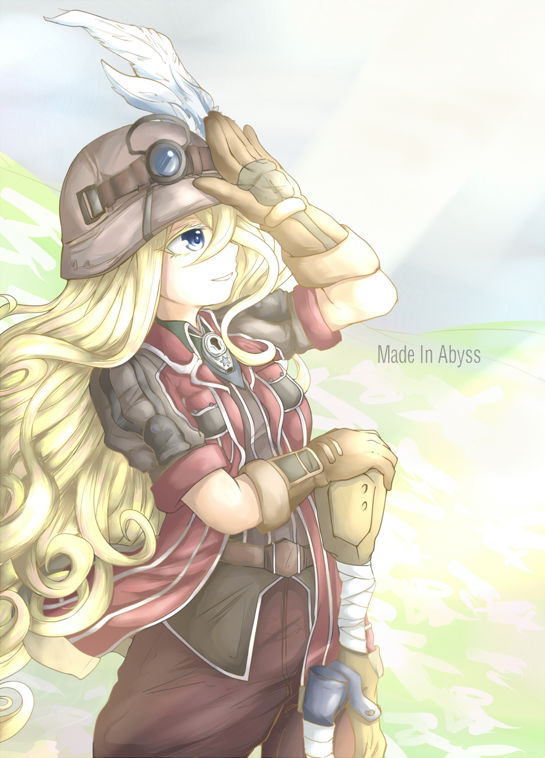

| 姓名            | 种族     | 阵营     | 语言   |
| --------------- | -------- | -------- | ------ |
| 莱莎 | 神裔(迦楼罗血脉)     | 中立善良 | 通用语 |
| **性别**        | **体型** | **信仰** |
| 女              | 中型     | 洛山达 |

角色简介

莱莎从小跟随家族的商队往来于无冬城与深水城之间，她的父亲是一个成功的商人，手段却往往不大光彩。

父亲希望她有朝一日可以接替自己的衣钵，可莱莎却并不喜欢这样的生活方式。相比于市井的尔虞我诈，她更渴望冒险的生活。

几年前，曾经有一位客人在他父亲的摊位上落下了自己的滑膛枪，父亲悄悄把它藏了起来，打算之后卖个好价钱。

但没想到这把枪年久失修，打都打不响，只能卖个废料钱。就在父亲大失所望，准备把它处理掉的时候，莱莎把它留了下来。

一开始只是当作玩具，但每天摩挲把玩，又用零花钱更换了一些新的零件，这把旧枪倒也慢慢趁手起来。

一天夜里，商队刚刚在深水城卸了货，大家劳累了一路都早早睡了，只有莱莎偷空到城里溜达。

在一个幽深的小巷里，遇到了一只乖巧的魔法兽。

“和我签订契约，成为魔法少女吧”

“好的”

莱莎觉得这是命运的选择，连条件都没问，就一口答应了下来。

从那天开始，莱莎发现自己交上了好运，做什么都很十分如意。

但命运的馈赠，往往已在暗中标好了价格，只是偿还的那一天，还不知道什么时候到来。

种族特性替换

实语者（Truespeaker）：有些神裔的语言能力没有极限。他们的语言学和察言观色检定获得+2种族加值，并且在每次升级语言学技能时可以学习两种新语言。该种族特性取代技能奖励。

**类法术能力** 每天一次，神裔能以类法术能力使用‘识破隐形’，施法者等级等于神裔的职业等级。（迦楼罗血脉）

**人之子（Scion of Humanity）**：一些神裔的天界血统已非常淡薄。该种族特性让神裔在判断种族时同时被判定为一个本地异界生物和类人生物（人类），在计算专长和法术先决条件时被算作类人生物。她不必使用易容技能即可伪装成人类。该种族特性从起始语言里删除天界语并改变生物类别。

### 属性

|      | 属性 | 修正值 | 初始 | 调整   |
| ---- | ---- | ------ | ---- | ------ |
| 力量 | 10   | 0      | 10   |
| 敏捷 | 20   | +5     | 18   | 种族+2 |
| 体质 | 13   | +1     | 13   |
| 智力 | 10   | 0      | 10   |
| 感知 | 16   | +3     | 14   | 种族+2 |
| 魅力 | 10   | +0     | 10   |

#### 豁免

|      | 修正值 | 详情           |
| ---- | ------ | -------------- |
| 强韧 | +3     | 基础+2, 体质+1         |
| 反射 | +7     | 基础+2, 敏捷+5         |
| 意志 | +3     | 基础+0, 感知+3 |

#### 防御

|          | 值  | 详情                 |
| -------- | --- | -------------------- |
| HP       | 11  | 基础+10,体质+1 |
| AC       | 18  | 敏捷+5,盔甲+3        |
| 接触     | 15  | 敏捷+5               |
| 措手不及 | 13 | 盔甲+3               |

#### 战斗

|      | 修正值 | 详情                 |
| ---- | ------ | -------------------- |
| 先攻 | +5     | 敏捷+5       |
| BAB  | 1      |                      |
| CMB  | +1      |  BAB1+力量修正0+体型修正0                    |
| CMD  | 16     | 10+BAB1+力量修正0+敏捷修正5+体型修正0               |

| 武器 | 伤害              | 攻击加值 | 射程 | 详情   |
| ---- | ----------------- | -------- | ------ |------ |
| 滑膛枪 | 1d12+致命瞄准2/X4     | +5(bab1+敏捷5+致命瞄准-1) | 40 尺 | 对抗接触AC, 移动动作装纸包弹，哑火值1-3, 5尺 |
| 长弓 | 1d8+致命瞄准2/19-20X2     | +5(bab1+敏捷5+致命瞄准-1) | 100 尺 |   |

#### 其他

| 感官         | 速度 | 察觉 |
| ------------ | ---- | ---- |
| 黑暗视觉(60) | 30   | +9 |

| 抗性 | 值  | 详情 |
| ---- | --- | ---- |
| 寒冷 | 5   |      |
| 强酸 | 5   |      |
| 电击 | 5   |      |

### 职业: 铳士（步枪士变体）

| 等级 | 天赋职业奖励 | 能力                                        | 专长                          |
| ---- | --- | ------------------------------------------- | ----------------------------- |
| 1    | 勇毅点数上限+1/4  | 炫技，勇毅，枪匠，快速装填(滑膛枪) | 致命瞄准 |

### 勇毅

**勇毅点数上限：3**（感知+3）

**火器重击（Critical Hit with a Firearm）**：每当铳士在白热化战斗中使用火器重击并成功确认时，她恢复1点勇毅值。

**一枪致命（Killing Blow with a Firearm）**：每当铳士在白热化战斗中使用火器将一个生物的生命值降至0或更低时，她恢复1点勇毅值。

### 炫技（Deeds）
铳士花费勇毅值来实现炫技。

**狙击之眼（Deadeye, Ex）**：1级时，铳士可以在她的火器的第一个射程增量后瞄准接触AC。使用本动作在第一个射程增量后的每个增量花费1点勇毅值。铳士在使用本动作时，仍旧在第一个射程增量后的每个增量受到攻击检定-2减值。

**快速清膛（Quick Clear, Ex）**：1级时，铳士可以用一个标准动作移除一件她当前正在使用的火器的破损状况，只要该状况是由于枪械哑火而造成。她只能在当前的勇毅值为1点以上时使用此动作。铳士也可以主动消耗1点勇毅值，以移动动作来完成此炫技。

**稳定瞄准（Steady Aim, Ex）**：1级时，只要步枪士还有1点勇毅点数，他就可以用一个移动动作来强化双手火器的精确性。当他这么做的时候，他所持用火枪的射程增量距离增加10尺，此加值和其他增加射程增量的加值叠加。此铳技取代铳士闪避。

### 专长

1级人物 **致命瞄准（Deadly Aim）** 你可以选择使所有的远程攻击检定受到-1的减值以换取伤害+2。你的BAB每+4，减值再-1，伤害再+2。你必须在攻击检定前选择使用本专长，效果持续到你的下一轮。本专长对于接触攻击或不造成HP伤害的攻击无效。

1级铳士 **枪匠（Gunsmithing, UC）** 可以制造，修理和维护火器

1级铳士 **快速装填(滑膛枪)** 装填火器的动作加快一级

### 称号

| 称号     | 效果   |
| -------- | ------ |
| 魔法少女 | **幸运数字(Su)** 每天休息结束时可以骰一个d20,并记录为今天的幸运数字.当天自己任何一个d20的原始结果为幸运数字时,可以替换为20,每天1次 |

### 技能

技能加点 2(等级 1x2 = 2)

| 技能       | 调整值 | 技能点数 | 本职 | 属性 | 其它     |
| ---------- | ------ | -------- | ---- | ---- | -------- |
| 运动         | -1     | 0        | +3   | +0 | 盔甲-1         |
| 巧手         | +8     | 1        | +3   | +5   | 盔甲-1         |
| 特技         | +4     | 0        | +3   | +5   |  盔甲-1          |
| 隐匿         | +4     | 0        | +0   | +5   | 盔甲-1         |
| 骑术         | +4     | 0        | +3   | +5   | 盔甲-1         |
| 知识(自然) | +0     | 0        | +3   | +0   |
| 知识(世界) | +0     | 0        | +3   | +0   |
| 知识(宗教) | +0     | 0        | +0   | +0   |
| 知识(奥秘) | +0     | 0        | +0   | +0   |
| 语言学      | +2     | 0        | +0   | +0   | 种族+2   |
| 察觉         | +9     | 1        | +3   | +3   | 种族+2   |
| 沟通         | +0     | 0        | +3   | +0   | 
| 使用魔法装置 | 0     | 0        | +0   | +0 |

### 装备（100/500）
| 装备         | 价格 g | 重量 lb | 简介 |
| ------------ | ------ | ------- | ---- |
| 典礼护甲 | 25    | 20      |
| 长弓 | 75    | 3       |
| 滑膛枪 | -    | 9       |

### 消耗品
| 物品           | 数量 | 单价 g | 保管者 | 描述 |
| -------------- | ---- | ---- | ---- | ---- |
| 炼狱治疗卷轴   | 2    | 25    | 
| 强酸瓶 | 2  | 10    | 

<table>
    <tr>
	<td>剩余金币</td>
        <td>130g</td>
	<td>负重情况</td>
        <td>32磅/轻载</td>
	<td>33/66/100</td>
    </tr>
</table>

