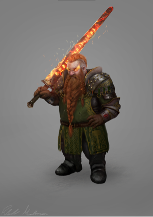

> You know who's going to inherit the Earth? Arms dealers.

### 基础属性

<table>
  <tr>
      <td>名字</td>
      <td>艾赛韩德</td>
      <td>职业</td>
      <td>2级牧师</td>
  </tr>
  <tr>
      <td>阵营</td>
      <td>混乱中立</td>
      <td>信仰</td>
      <td>Gorum(古拉姆)</td>
  </tr>
  <tr>
      <td>体型</td>
      <td>中型</td>
      <td>性别</td>
      <td>男</td>
  </tr>
  <tr>
      <td>种族</td>
      <td>矮人</td>
      <td>速度</td>
      <td>20尺</td>
  </tr>
  <tr>
      <td>先攻</td>
      <td>+3</td>
      <td>意志</td>
      <td>+6</td>
  </tr>
</table>
<table>
  <tr>
      <td>察觉</td>
      <td>+4</td>
      <td>感知</td>
      <td>黑暗视觉(60尺)</td>
  </tr>
</table>
<table>
    <tr>
        <td>语言</td>
        <td>通用语, 矮人语, 深渊语</td>
    </tr>
</table>

|      | 属性 | 调整值 | 初始属性 | 属性调整 |
| ---- | ---- | ------ | -------- | -------- |
| 力量 | 16   | +3     | 16       |
| 敏捷 | 14   | +2     | 14       |
| 体质 | 12   | +1     | 10       | 种族+2   |
| 智力 | 10   | +0     | 10       |
| 感知 | 16   | +3     | 14       | 种族+2   |
| 魅力 | 12   | +1     | 14       | 种族-2   |

<table>
    <tr>
        <td>BAB</td>
        <td>+1</td>
        <td>CMB</td>
        <td>+4</td>
        <td>CMD</td>
        <td>16</td>
    </tr>
</table>

### 攻击

| 武器       | 攻击加值 | 伤害               |
| ---------- | -------- | ------------------ |
| 巨剑(精品) | +5       | 2d6+3/19-20X2      |
| 轻弩(精品) | +4       | 1d8/19-20X2, 80 尺 |

### 防御

<table>
    <tr>
        <td>AC</td>
        <td>18(+6护甲+2敏捷),措手不及16,接触12</td>
    </tr>
	<tr>
        <td>HP</td>
        <td>16</td>
    </tr>
</table>
<table>
    <tr>
        <td>强韧</td>
        <td>+4</td>
        <td>反射</td>
        <td>+2</td>
        <td>意志</td>
        <td>+6</td>
    </tr>
</table>

### 种族特性和背景特性

**从商者（Merchant）【UCa】：** 你曾是位商人，以收购和出售货物为业。你在为货物价格议价时估价和察言观色检定获得+1 背景加值。估价总是你的本职技能。

**精锐军（Veteran of Battle，混乱中立）【APG】（古拉姆，Gorum）** 你跨越了无数战阵，每一次都感受到古拉姆在指引着你挥剑的臂膀，使你在瞬息之间一闪逆转。你的先攻检定获得+1 背景加值，此外只要你能在突袭轮行动，你能在该轮以自由动作拔出一件武器（但不能是药水或魔法物品）。

**慢而稳（Slow and Steady）** 矮人拥有 20 尺基本速度，但是其速度不会受到负重以及盔甲影响。

**黑暗视觉（Darkvision）** 矮人在黑暗中能够看到 60 尺远。

**防御训练（Defensive Training）** 矮人在对抗巨人子类的生物时，AC 获得+4 闪避加值。

**贪婪（Greed）** 矮人在使用估价检定判断含有珍贵金属或宝石的非魔法物品的价值时，获得+2 种族加值。

**仇恨（Hatred）** 由于经过专门的针对性训练，矮人在对抗类人生物中，兽人子类以及地精子类的生物时，他们的攻击检定获得+1 种族加值。

**坚韧（Hardy）** 矮人在对抗毒素，法术以及类法术能力时，豁免检定获得+2 种族加值。

**稳固（Stability）** 当矮人站立在实体地面上时，他们对抗冲撞以及绊摔战技的 CMD 获得+4 种族加值。

**岩石敏锐（Stonecunning）** 矮人在察觉异常的石制造物（比如石墙与石制地板中隐藏的陷阱与密门）时，察觉检定+2。当他们在这些石制造物 10 尺范围内时，就可以进行检定，无论他们是否在主动搜索。

### 职业特性

**灵光(Aura, Ex)** 信奉混乱、邪恶、善良或秩序神祇的牧师拥有和神祇阵营相同的灵光（见‘侦测邪恶（Detect Evil）’法术的说明）。

**引导能量(Channel Energy, Su)** 无论阵营，任何牧师都能通过圣徽(或邪徽)来释放源自信仰的能量波。这种能量可以用来治疗或者造成伤害，取决于能量类型和目标物种。一个善良牧师（或者信奉善良神）引导正能量，可以伤害不死生物或者用于治疗活物。一个邪恶牧师（或者信奉邪恶神）引导负能量，用于对活物造成伤害或者治疗不死生物。信奉中立神的中立牧师（或者无神牧师）必须选择引导正能量还是负能量，一旦确定不能更改。这个选择还决定牧师是自发治疗法术还是造成伤害法术。
　　引导能量是以牧师为中心半径 30 尺的爆发范围，影响同一类的所有生物（活物或是不死生物）。造成和治疗的伤害等于“1d6+每比 1 级多 2 牧师等级 1d6”（3 级 2d6，5 级 3d6，以此类推）。生物可以通过意志豁免来降低一半伤害，DC 是“10+1/2 牧师等级+魅力修正”。治疗的能量不能使生命超过最大生命值，多余的会被浪费掉。牧师每天能够引导能量的次数相当于“3+魅力修正”。这是一个不会引起藉机攻击的标准动作，牧师可以选择自己是否包含在内。牧师必须能亮出圣徽以使用这个能力。

**领域(Domains)** 牧师的神和阵营，决定他能够使用什么法术、他的价值观和别人怎么看他。牧师选择他的神的两个领域，当他的阵营对应的时候，可以选择阵营领域（秩序、混乱、善良、邪恶）。如果牧师不信奉特定的神，他依然可以选择两个领域来代表他的灵性倾向和能力（交由 GM 决定）。但仍须遵守阵营领域的限制。每个领域授予一些领域能力，取决于牧师等级，在每个法术等级都有领域法术栏位，可以用来准备其中一个领域的法术。如果某个领域法术不在牧师法术列表上，便只能使用领域法术栏位准备该法术。领域法术不能用来自发转化。此外，牧师得到他领域中列出的能力，如果他等级够高的话。除非另有说明，使用领域能力是一个标准动作。

**祷念(Orisons)** 每天牧师可以准备一些祷念或称 0 环法术，正如上表。这些法术的施展如同其他任何法术，但它们不会在施展的时候消耗掉，并且可以被再次使用。

**法术转换(Spontaneous Casting，又译自发施法)** 善良牧师（或信仰善良神祇的中立牧师）可以将事先准备好的法术（祷念和领域法术不可）临时转换成医疗法术，即使他事前并未准备该医疗法术也可。此时，牧师会“失掉”一个准备好的法术，换得一个同环级（或较低环级）的‘治疗伤害’法术。邪恶牧师（或信仰邪恶神祇的中立牧师）不能将法术转换成医疗法术，但却可以转换成‘造成伤害’法术。信仰中立神祇的中立牧师可以在上述两种法术转换中择其一，但是做出决定之后便再也无法改变。此选择亦决定该中立牧师能引导正能量还是负能量。

**混乱、邪恶、善良和秩序法术（Chaotic, Evil, Good, and Lawful Spells）** 牧师无法施展与神祇或本身阵营相反的法术。对应阵营的法术会有相关描述符加以识别。

**额外语言（Bonus Languages）** 牧师的额外语言选项包括：天界语、深渊语和炼狱语（分属于善良、混乱、邪恶和秩序阵营之异界生物的语言）。牧师还可以因为种族而获得额外语言。

### 专长

1 级人物 **额外导能（Extra Channel）**

### 法术

| 环位 | 每日法术数量 | 法术                                |
| ---- | ------------ | ----------------------------------- |
| 0 环 | 无限         | 造水术,侦测魔法,神导术,光亮术       |
| 1 环 | 4            | 熵光护盾,知己知彼,阳炎武器,克敌机先 |

### 领域

#### 毁灭领域

**毁灭打击（Destructive Smite, Su）** 你获得破坏性的重击之力: 此超自然能力可以在单次近战攻击中给伤害骰等于牧师等级一半的士气加值(最少为 1)。你必须在攻击前声明使用毁灭打击。你每天可以使用此能力次数“3+感知修正”。

#### 战争领域 - 战术子域

**兵贵神速（Seize the Initiative, Su）** 此能力需在你和队友投先攻出结果前发动，可让 30 尺内一人双投任取。每天“3+感知修正”次。此能力替换战争领域的战斗狂暴能力。

### 技能

技能加点 5 (护甲减值-1)

| 技能       | 调整值 | 技能点数 | 本职 | 属性 | 其它 |
| ---------- | ------ | -------- | ---- | ---- | ---- |
| 估价       | +4     | 1        | +3   | +0   |
| 交涉       | +5     | 1        | +3   | +1   |
| 知识(历史) | +4     | 1        | +3   | +0   |
| 知识(贵族) | +4     | 1        | +3   | +0   |
| 察言观色   | +7     | 1        | +3   | +3   |

### 装备

| 装备       | 价格 g | 重量 lb | 简介 |
| ---------- | ------ | ------- | ---- |
| 胸甲(精品) | 350    | 30      |
| 巨剑(精品) | 350    | 8       |
| 轻弩(精品) | 335    | 4       |
| 弩矢       | 2      | 2       |

<table>
    <tr>
        <td>剩余金币</td>
        <td>163</td>
        <td>负重情况</td>
        <td>44磅/轻载</td>
        <td>76/153/230</td>
    </tr>
</table>

### 描述

武器商人学徒的经历让艾赛韩德接触到了伟大的古拉姆, 只是泡在武器堆里是不够的, 抄起家伙, 砍就是了.
