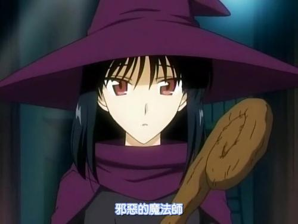

### 描述

文化祭最终的话剧上，阴差阳错饰演王子的泽近竟然要去吻睡在原本应该是周防饰演的公主的床上的播磨， 另外还有躲在被子里的八云，话剧演出陷入失控，不得不自由发挥的八云即兴以邪恶魔法师的身份登场，在与醋意大发的泽近的较量中误击中了泽近的面部，此后泽近始终怀恨在心并把八云看做头号情敌。

### 基础属性

<table>
  <tr>
      <td>名字</td>
      <td>冢本八云</td>
      <td>职业</td>
      <td>3级女巫</td>
  </tr>
  <tr>
      <td>阵营</td>
      <td>中立善良</td>
      <td>信仰</td>
      <td>无</td>
  </tr>
  <tr>
      <td>体型</td>
      <td>中型</td>
      <td>性别</td>
      <td>女</td>
  </tr>
  <tr>
      <td>种族</td>
      <td>人类</td>
      <td>速度</td>
      <td>30尺</td>
  </tr>
  <tr>
      <td>先攻</td>
      <td>+13(3敏捷+4魔宠+2背景+4专长)</td>
      <td>察觉</td>
      <td>9(3技能 +3本职 +0感知 +2魔宠 +1背景)</td>
  </tr>
</table>
<table>
  <tr>
      <td>感知</td>
      <td>普通视觉</td>
  </tr>
</table>
<table>
    <tr>
        <td>语言</td>
        <td>通用语, 龙语, 地底通用语, 地精语, 水族语, 木族语</td>
    </tr>
</table>

|      | 属性 | 调整值 | 初始属性 | 属性调整 |
| ---- | ---- | ------ | -------- | -------- |
| 力量 | 7   | -2     | 7       |
| 敏捷 | 16   | +3     | 16       |    |
| 体质 | 14   | +2     | 14       |    |
| 智力 | 20   | +5     | 18       | 种族+2   |
| 感知 | 11   | 0     | 11       |
| 魅力 | 7   | -2     | 7       |

<table>
    <tr>
        <td>BAB</td>
        <td>+1</td>
		    <td>CMB</td>
        <td>-1（1基本-2力量）</td>
		    <td>CMD</td>
        <td>12（11基本-2力量+3敏捷）</td>
        <td>专注</td>
        <td>8（3CL+5智力）</td>
    </tr>
</table>

### 攻击

| 武器         | 攻击加值           | 伤害          |
| ------------ | ------------------ | ------------- |
| 轻弩 | +4(bab1+敏捷3)       | 1d8/19-20X2, 80 尺 |
| 匕首 | -1(bab1-力量2)       | 1d4/19-20X2 |

### 防御

<table>
    <tr>
        <td>AC</td>
        <td>14(1护甲+3敏捷),措手不及11,接触13</td>
    </tr>
    <tr>
        <td>HP</td>
        <td>23(6(初始)+8(升级)+3\*2(体质)+3天赋职业奖励)</td>
    </tr>
</table>
<table>
    <tr>
        <td>强韧</td>
        <td>+3</td>
	    	<td>反射</td>
        <td>+4</td>
	    	<td>意志</td>
        <td>+3</td>
    </tr>
</table>

### 种族特性和背景特性

**奖励专长**：人类角色在1级时获得一个额外专长。

**奖励技能**：人类在1级以及以后每次升级时获得1点额外技能点。

**反制者（战斗背景）**：你幼时常受人欺负，但从来都不会主动发难。取而代之的是你精于预见突然袭击、并能够快速应对威胁。你的先攻检定获得+2背景加值。

**古墓丽影（战役背景）**：你一生绝大部分时间都是在对奥斯力昂的古墓和地下墓穴的探索中度过的。你的察觉和知识（地下城）技能获得+1背景加值，其中之一（察觉）成为你的本职技能。

### 职业特性

### 巫术
1级 **邪眼（Evil Eye, Su）** ：女巫能够引发距离她30尺内、并且她所能看见的敌人心中的迷惘。目标的以下一项数据遭受-2减值（由女巫选择）：AC、属性、攻击、豁免或技能检定。此巫术持续轮数为“3+智力修正”，成功的意志豁免可以将其减至1轮。这是一项〔影响心灵〕的效果。8级时，此能力给予的减值提升至-4。

2级 **沉眠（Slumber, Su）** ：女巫能够令30尺内一名生物陷入深沉的魔法睡眠，如同‘睡眠术’的效果。目标生物可以通过成功的意志豁免令其无效。若豁免失败生物将陷入沉睡，持续轮数等同于女巫等级。本巫术能够影响任意HD的生物。目标生物不会因为噪音或光亮而醒来，但他人可以使用标准动作唤醒目标。若目标生物遭受了任何伤害，巫术立刻结束。无论豁免成功与否，该生物在1天内都不会再次成为此巫术的目标。

1级专长额外巫术 **尖笑（Cackle, Su）**：女巫可以用移动动作发出刺耳尖笑。任何距离女巫30尺之内，并受到她所施展的【苦咒】、【魅惑】、【邪眼】、【祈福】或【降祸】巫术影响中的生物，所受的以上效果延长1轮。

3级专长额外巫术 **祈福（Fortune, Su）**：女巫能够为30尺内的一名生物在1轮内带来好运。每轮1次，目标能够凭借好运使任何属性、攻击、豁免或技能检定双骰取高。生物必须在检定开始前决定是否需要使用此能力。8级和16级时，此巫术的持续时间都会延长1轮。每当一名生物受益于此巫术，24小时内无法再次从中获益。

### 天赋职业奖励
| 等级         | 奖励          |
| --- | ------------------ |
| 1 | 增加1hp |
| 2 | 增加1hp |
| 3 | 增加1hp |

### 专长

1级人物 **强化先攻** 先攻+4

1级人类 **额外巫术** 尖笑

3级人物 **额外巫术** 祈福

### 技能

技能加点 24 (护甲减值 0)

| 技能       | 调整值 | 技能点数 | 本职 | 属性 | 其它     |
| ---------- | ------ | -------- | ---- | ---- | -------- |
| 知识(神秘) | +11     | 3        | +3   | +5   |
| 知识(自然) | +11     | 3        | +3   | +5   |
| 知识(地城) | +7     | 1        | +0   | +5   | 背景+1
| 知识(位面) | +9     | 1        | +3   | +5   |
| 知识(宗教) | +6     | 1        | +0   | +5   |
| 知识(地方) | +6     | 1        | +0   | +5   |
| 知识(历史) | +9     | 1        | +3   | +5   |
| 知识(工程) | +6     | 1        | +0   | +5   |
| 知识(贵族) | +6     | 1        | +0   | +5   |
| 知识(地理) | +6     | 1        | +0   | +5   |
| 语言学 | +6     | 1        | +0   | +5   | 
| 法术辨识 | +11     | 3        | +3   | +5   |  |
| 解除装置 | +4     | 1        | +0   | +3   |
| 巧手 | +5     | 2        | +0   | +3   |
| 察觉 | +9     | 3        | +3   | +0   | +2 (魔宠) +1(背景) |
| 攀爬 | -2     | 0        | +0   | -2 |
| 特技动作 | +3     | 0        | +0   | +3   |
| 逃脱 | +3     | 0        | +0   | +3   |
| 察言观色   | +2     | 0        | +0   | +0 | +2 (魔宠) |

### 欺瞒庇护主
| 等级 | 奖励法术                    |
| ---- | ------------ |
| 2级 | 腹语术（ventriloquism） |
| 4级 | 隐形术（invisibility） |

### 每日准备法术

| 环位 | 法术位 | 法术(DC)                     | 防御式施法专注DC:15+法术环位*2 |
| ---- | ------------ | ------------------------ | ------------------------ |
| 0 环 | 4 | 侦测魔法, 稳定伤势, 幻音术, 舞灯术 | 15
| 1 环 | 2 + 2智力 | 睡眠术16/, 命令术16\*2, 巫术易伤16 | 17
| 2 环 | 1 + 1智力 | 闪光尘17, 蛛网术17 | 19

### 法术书

| 环位 | 法术数量 | 法术列表 |
| ---- | ------------ | ------------------------ |
| 0 环 | 全部 |
| 1 环 | 3+5+2 |命令术, 法师护甲, 巫术易伤, 凶兆, 睡眠术, 刺耳尖啸, 魅惑人类, 隐雾术, 治疗轻伤, 燃烧之手, 腹语术(庇护主)  |
| 2 环 | 2 |闪光尘, 蛛网术 |

一个新的魔宠开始时知道所有的0环法术，以及女巫可以施展的每个法术环级2个法术。这不包括任何魔宠基于女巫的等级与她的庇护主所知道的奖励法术（参照庇护主法术）。
当女巫升级时，她可以从女巫法术列表选取2个法术添加到她的魔宠储存法术中，这2个法术必须是她可以施展的法术环级。

### 装备

| 装备         | 价格 g | 重量 lb | 简介 |
| ------------ | ------ | ------- | ---- |
| 腹卷 | 3    | 1      |
| 轻弩 | 35    | 4       |
| 弩矢×20       | 2      | 2       |
| 匕首 | 2    | 1       |

### 物品

| 装备         | 价格 g | 重量 lb | 简介 |
| ------------ | ------ | ------- | ---- |
| 隐雾术（Obscuring Mist）卷轴 | 25    |
| 炽火胶 | 20    |
| 法师护甲(Mage Armor) 魔杖50/50 | 750    |
| 治疗轻伤 (Cure Light Wounds)魔杖45/50 | 750    |
| 隐形术 (Invisibility)卷轴 | 150    |
| 云雾术 (Fog Cloud)卷轴 | 150    |
| 带盖提灯 | 7    | 2    |

<table>
    <tr>
        <td>剩余金币</td>
        <td>606G</td>
		    <td>负重情况</td>
        <td>13磅/轻载</td>
		    <td>23/46/70</td>
    </tr>
</table>

### 魔宠

<table>
  <tr>
      <td>名字</td>
      <td>伊織(lori)</td>
      <td>类型</td>
      <td>兔子</td>
  </tr>
  <tr>
      <td>体型</td>
      <td>超小型</td>
      <td>速度</td>
      <td>50尺</td>
  </tr>
  <tr>
      <td>先攻</td>
      <td>+3</td>
      <td>察觉</td>
      <td>+1</td>
  </tr>
</table>
<table>
  <tr>
      <td>感知</td>
      <td>昏暗视觉(60尺)</td>
  </tr>
</table>

<table>
    <tr>
        <td>AC</td>
        <td>15,措手不及12,接触15</td>
    </tr>
    <tr>
        <td>HP</td>
        <td>7(1HD)</td>
    </tr>
</table>
<table>
    <tr>
        <td>强韧</td>
        <td>+1</td>
	    	<td>反射</td>
        <td>+5</td>
	    	<td>意志</td>
        <td>+4(主人3,+感知1)</td>
    </tr>
</table>

| 武器         | 攻击加值           | 伤害          |
| ------------ | ------------------ | ------------- |
| 啮咬 | -2 | 1d3-4 | 

<table>
    <tr>
        <td>BAB</td>
        <td>+0</td>
		    <td>CMB</td>
        <td>-1</td>
		    <td>CMD</td>
        <td>7（对抗摔绊11）</td>
    </tr>
</table>

**专长** 飞跑（Run）
**技能** 潜行+15

**特殊能力**
主人的先攻获得+4加值
警觉（Alertness, Ex）：当魔宠在一臂之距内时，主人获得“警觉”专长，察觉和察言观色检定+2。
精通反射闪避（Improved Evasion, Ex）
法术共享（Share Spells, Ex）
情感连接（Empathic Link, Su）
